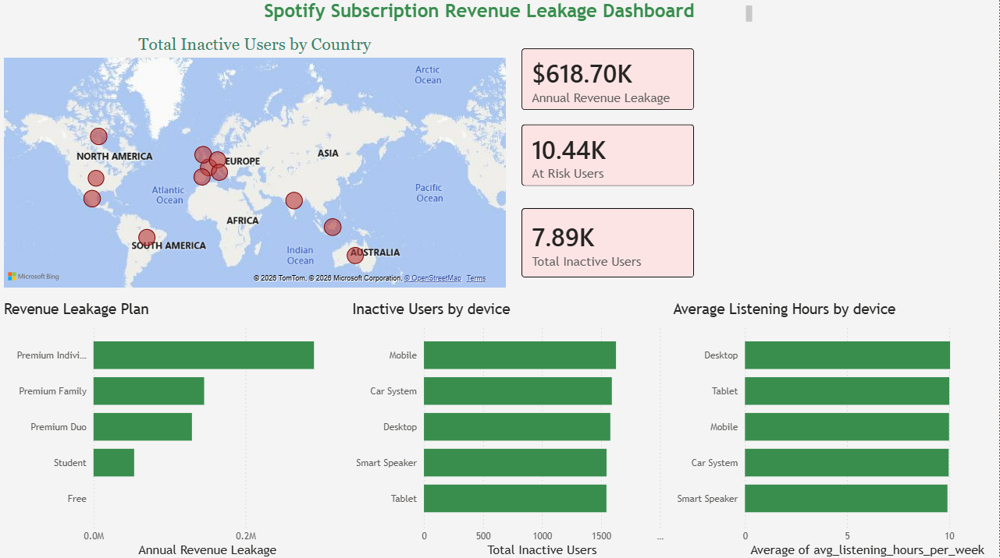

# spotify-revenue-leakage
SQL + Power BI analysis identifying $618,699 in annual subscription revenue leakage across 50,000 Spotify users
# Spotify Subscription Revenue Leakage Detector

## Project Overview
End-to-end SQL + Power BI analysis on 50,000 Spotify user records, identifying 
$618,699 in annual subscription revenue leakage and flagging 10,435 active users 
at risk of going inactive.

## Business Problem
Spotify loses revenue every month from inactive subscribers who stopped engaging 
but haven't formally cancelled. This project quantifies that leakage and identifies 
which plans, countries, and user segments are most at risk.

## Key Findings
- $618,699 in annual revenue leakage across 5 subscription plans
- 7,891 inactive users identified
- 10,435 active users showing early churn signals
- Premium Individual plan = the highest paid revenue loss at $290,136 annually
- Indonesia = the highest inactive user country with 693 users

## Tools Used
- SQL Server - data storage and analysis
- Power BI - dashboard and visualization
- DAX - KPI measures and calculations

## SQL Queries
7 business queries covering:
1. Active vs Inactive user breakdown
2. Revenue leakage by subscription plan
3. Inactive users by country
4. Monthly and annual revenue leakage calculation
5. At-risk active users identification
6. Average listening hours by plan
7. Device type vs inactive users

## Dashboard
Power BI dashboard includes:
- 3 KPI cards — Annual Revenue Leakage, Total Inactive Users, At Risk Users
- Bar chart — Revenue leakage by subscription plan
- World map — Inactive users by country
- Bar chart — Device type vs inactive users
- Bar chart — Average listening hours by device

## Dataset
Spotify User Behavior Dataset — 50,000 records
Source: Kaggle

